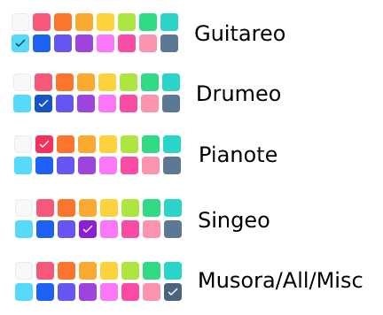

# Overview

All marketing dev projects exist inside 
the musora Asana team [Marketing-Dev](https://app.Asana.com/0/1199995198037877/overview).
Developers, creative team members, and marketers associated with the project 
should use this same project in Asana. A new Asana project should be created if the project
will take more than a few hours to complete or if the project requires the full workflow 
of design, development, QA, review, deployment. The Asana project is created using the 
[X - Project Template 2021](https://app.asana.com/0/1199995198037881/list) template.
The asana project should always be added to the 
[Dev-Marketing Asana Portfolio](https://app.asana.com/0/portfolio/1200330095730280/list) once its created.

Anyone can get an overview of all ongoing and scheduled projects and see their priority
in the [Dev-Marketing Asana Portfolio](https://app.asana.com/0/portfolio/1200330095730280/list). Checkout the 'List'
 and 'Timeline' tabs.

# Project Stages, Milestones, & Scheduling

Each state of a project has a section (in bold) and associated milestone (underneath).  
The project schedule is based off a 1-month cycle, 22 working days total. Based on the configured start and end date
Asana will automatically set the dates for each milestone automatically using the percentages.

 

### 1. Ideation, Planning, Docs & Links (4 working days - 18%)
- Finish marketing project planning
  
### 2. Design/Creative Tasks (5 working days - 23%)
- Finish designs/assets and design review, get approval from project owners

### 3. Front-End Development Tasks (6 working days - 27%)
- Finish coding the front end

### 4. Back-End Development Tasks (1 working days - 5%)
- Finish coding the back end

### 5. QA Testing Tasks (1 working days - 5%)
- Finish QA testing

### 6. Review Tasks (4 working days - 23%)
- Finish review by marketing/creative team, get approval for final launch from project owners

### 7. Launch & Post-Launch Review Tasks (1 working days - 5%, can go on for 2 weeks past launch date)
- Launch this project to students, notify marketing and creative teams (using slack)

 

# Milestones Explained

Each milestone is dependent on the previous one in the list. Once the first milestone is marked complete,
the next milestone will get automatically unblocked and change from 'Blocked' status to 'Unbegun'.
Once a milestone is unblocked, it will be automatically assigned to the relevant person. 
This prevents peoples my tasks lists from getting cluttered with tasks that they are not yet able to
work on.  

1. **Finish marketing project planning**  
Assigned to and completed by project owner.  
The project owner should assign this milestone to themself.
     
1. **Finish designs/assets and design review, get approval from project owners**  
Assigned to and completed by the assigned creative team member.  
Currently tasks in here are automatically assigned to Jord P.

1. **Finish coding the front end**  
Assigned to and completed by the relevant FE developer.  
Currently tasks in here are automatically assigned to Trent H.

1. **Finish coding the back end**  
Assigned to and completed by the relevant BE developer.  
Currently tasks in here are automatically assigned to Caleb F.
   
1. **Finish QA testing**  
Assigned to and completed by the relevant developer OR QA team member.  
Currently tasks in here are automatically assigned to Trent H.
  
1. **Finish review by marketing/creative team, get approval for final launch from project owner**  
Assigned to and completed by project owner and involved creative team members.  
The project owner should assign this milestone to themself.

1. **Launch this project to students, notify marketing and creative teams (using slack)**  
Assigned to and completed by the relevant project owner.  
Currently tasks in here are automatically assigned to Trent H.

 

## Is it a project or a small update?  

### It's a small update that will take less than a few hours and doesn't require the full workflow:
- Check if there is an existing Asana project for wherever you would like to make the update.
  If so, please create a new task in the 'Post Launch Tasks, Monitoring, Review' section.
- Otherwise, if there is no existing project, please create a new task in the Asana project named 
'Misc Tasks'.
  
The most important question to ask when determining whether you need a full project or just a misc task is: 
**Does this require work and coordination from multiple departments?** If so, you should likely use a project.  

For example: 'Trent can you please update the top banner on this page to say X instead of Y' is a misc task because
it doesn't need any design work. Some tasks which only require a small amount of design work may still only warrant
a misc task.

'We need a new design and new pages for our trial offers.' This should be a project since it will require design,
design review, coding, qa, etc.

When in doubt, create a misc task with the details of your project and post in the
dev-marketing-creative channel, and we'll figure it out together.
  
   

### It's a full project that needs the entire workflow:  

1. Create a new Asana project in the 'Dev-Marketing' team using the 'X - Project Template 2021' 
   template. Please use the project name format: 'PROJECT NAME - BRAND'.
   Please segment projects from the top level per brand. For example if every brand needs a 'April Promo Updates' 
   project, please make 1 project for each brand assuming the updates are large enough to justify a project
   
2. Choose a start and end date for the project. Typically, we operate on a monthly schedule so 
if the project is for a promotion that needs to launch July 1st, the start date can be June 1st, 
   and the end date July 1st. Please review the Asana portfolio timeline and project priority list when choosing a
   timeline. We will tackle priority issues and questions in our monthly dev-marketing meetings or in slack.

3. Please choose the relevant color for the brand and set it accordingly for the project.

2. If you are not already familiar, review the top guide task for your department 
   'How to use this project template & plan projects - **marketers** - DELETE ME' or 
   'How to use this project template - **devs** - DELETE ME'
   
4. Place all planning documentation, outlines, assets, etc inside the
   'Project overview, documents, design assets, etc - go here' task description.
   
5. Assign all the milestones that are relevant to your department. For example the 
   '_Finish marketing project planning_' task should be assigned to the marketer who owns the project. Generally,
   dev tasks should be assigned to Trent H. Design tasks should be assigned to Jord D. If you are not sure who to 
   assign leave the task unassigned. Please also assign multiple collaborators if necessary. For example the 
   '_Finish review by marketing/creative team, this project is approved for final launch_' task may often have multiple marketers
   set as collaborators if they would like to also review the project before launch.
   
6. Choose a final deadline when this project must be completed and live on production. Enter the Due Date for 
  'Launch this project to production' task inside the 'Launch' section. Please also enter this as the project due 
  date. You can do this when you create the project or by clicking the arrow to the right of the project name and 
  'Edit project details'. Setting the date for the project will make it show up in the overall team calendar
   view here: [Asana Dev-Marketing Team Calendar](https://app.asana.com/0/1199995198037877/calendar)
   The dev team will let you know if the deadline is possible. The dev team will set the review dates.
   
7. If the marketers project planning is complete and ready for design or dev, complete the 
   'Finish marketing project planning' task. 
   This task is set up as a dependency which means that other tasks 
   related to design and development will not be triggered to be ready to be started 
   until this planning task is marked complete.
   
8. Notify the dev and creative team about the project and that it's been set up using slack.

...

9. Once the design and development is complete, the project will be put on a testing, staging, or hidden production
url for review. A dev will notify the marketing & creative team via the slack channel **'devc-marketing-creative'** that the project is ready for review. An Asana task
   will also automatically be un-blocked.
   
10. Put your feedback and changes under the 'Review' section near the task called '_Review feedback goes here_'

11. Once the review is complete, and the project has been given approval for launch 
    by the project owners and the marketing team, complete the 
   '_Finish review by marketing/creative team, this project is approved for final launch_' task so the developers know when to launch
   the project. This task must be completed by the project owner, not a developer. Please also set a date for the '_Launch this project to production_' task if the project is not already
   live on production. The dev team will launch the project at the specified date and notify the marketing team right 
   after its live.
   
...

12. After the project is completely launched, please put all future feedback, change requests, 
   promo closures and updates, etc, in the '_Post Launch Tasks, Monitoring, Review_' section and assign to Trent.
