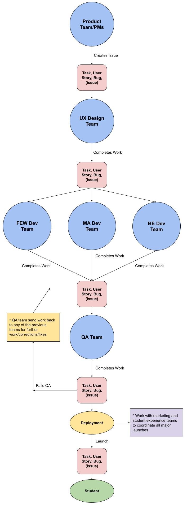

# YouTrack Setup Basics

 

## What Is YouTrack

_A project management tool that can be adapted to your processes to help you deliver great products. 
Track projects and tasks, use agile boards, plan sprints and releases, keep a knowledge base, work with 
reports and dashboards, create workflows that follow your business processes. Never force your process
to fit the limits of a tool again. Unlike other project management tools, YouTrack can be customized to your needs!_

 

## General YT Basics

YouTrack's most basic element is an **issue**. An issue can be thought of as a task, user story, issue, bug, 
(or sometimes an entire project), etc.

YouTrack also has **projects**. Projects contain issues and generally represent a specific project.

**Hierarchy: projects -> issues**

 

YouTrack also has **boards**. A board is a tabular way to visualise issues using rows and columns. Typically, 
the column names are the state of an issue such as 'to do', 'in progress', 'completed'. Issues can easily be moved between
rows and columns by clicking and dragging. This can be used to change the issues state or any other field/data.
Often times, the row names are the issues priority or project name. Rows and columns can be configured to be any 
field or value. A board can be used for multiple projects.

Boards contain **sprints** (if configured). A sprint is a way to encapsulate a set of issues that are relevant to 
a specific time period. Typically, if a team runs on a 2-week sprint cycle, they would choose which issues to tackle in
the upcoming 2 weeks, then complete those issues. After 2 weeks, any issues that were not completed would get moved
in to the following 2-week sprint. This makes it easy for team members to know what they should be working on, and 
it makes it easy to see what was completed in previous sprints.

**Hierarchy: boards -> sprints**

 

In summary, projects and issues represent work that needs to be done. Boards and sprints are for
managing which work should be done when, and what state the work is in.

 

## Musora's YT Setup - 'Projects' Project & Board

This project and relevant board holds issues which represent entire projects. Project managers and product directors will
manage these boards. The issues (which represent entire projects) contain information, links, and documentation 
about the projects. Any issue that is in progress or to be start soon will have a proper associated YouTrack project. 
The project should be linked in the description of the issue which represents it on this board.

Each issue has the following fields:

**Project Priority:**
- High: projects that are in progress or will be started next
- Medium: projects that are candidates to become high priority in the near future
- Low: projects that may become medium or high priority in the far future

**Project State:**
- Ideation: the project is still an idea that is being formed
- Project Planning: the project is a fully formed idea and the planning for how and when we can complete it has begun
- In Progress: the project has begun undergoing implementation such as ux design or development
- On Production: the project is live to students and may require follow-up work
- Complete: the project is totally complete and does not require further work from any product team member

**Start Date:**
When the project should be or was started.

**Deploy Date:**
When the project should be deployed to students. This is the deployment deadline for the project.

**Owner:**
The person who owns this project and is responsible for its timeline and outcome.

 

This board also has sprints, 1 for each year, which are primarily for organisation purposes.

 

**How to add a new project to the board:**
1. Create a new issue in the 'Projects' YouTrack project.
1. Add a relevant title for the project. Please use a version number when possible such as: Student Lists v2.0.
1. Add a description for the project which should include any relevant information, documentation, or links.
1. Set the project priority based on the above priority field options.
1. Set the project state which should most likely be Ideation if the project has not been started.
1. If the project is going to be medium or high priority, set the Start Date and Deploy Date fields. These can be 
   rough estimates if the dates are way out in the future.
1. Choose a project owner. Often times this will be a PM or PD (Randy, Caleb), or a developer.
1. Click create. Once the issue is created, it will automatically be added to the latest years sprint in the 'A - Projects'
   board. If the project should not be in the current years sprint please move it to another years sprint.
1. If this project is to be started soon, and it is ready for project planning, create a new YouTrack project for it. The 
   title of the YouTrack project should be the same as this issue. When creating a new YouTrack project, please use the 
   'Template Project v1.0' template. Tasks, user stories, etc can now be created in this new YouTrack project.
1. Add a link to the YouTrack project inside the representing issues' description.
1. Unfortunately, you must add the project to each of the follow agile boards manually from their settings area or issues won't work:
   - D - Deployment
   - S - BE Dev Team Sprints
   - S - FEW Dev Team Sprints
   - S - MA Dev Team Sprints
   - S - Product Team Sprints
   - S - QA Team Sprints
   - S - UX Design Team Sprints

Board link:
**[https://musoraproduct.myjetbrains.com/youtrack/agiles/121-11/122-18?tab=general](https://musoraproduct.myjetbrains.com/youtrack/agiles/121-11/122-18?tab=general)**

 

## Musora's YT Setup - Fields

**Priority** _default: low_  
Each issue has a priority field with 'High', 'Medium', and 'Low'. This is a somewhat generic field but generally
high issue should be worked on first, followed by medium, then low if there is time.

**Required Work** _default: [Deployment]_    
Each issue has a 'Required Work' field which is a multi select.
Each option represents a team inside the product department. If an issue requires work from a specific team it should
be checked off in this field.  
  
**- Once a team is checked-off under required work, the issue is automatically added to that teams backlog. -**  
Deployment should generally always be marked as required unless it's a special case.

**_\*Work States_** _default: all not required_  
See 'Musora's YT Setup - Team Sprint Boards' section for how these work and what they are.

**Deployment State** _default: [None]_  
This is for tracking where an issue is accessible. Other devs can review this fields value to see where they can
interact with or test the issue. Please always ensure to update this field when an issue is updated.  
The values are as follows:

- **None**: the issue is not anywhere and has likely not started dev yet
- **On Local Dev**: the issue can only be accessed in a local dev environment on a specific branch
- **On Staging**: the issue is deployed to our staging server
- **On App-Staging**: the issue is deployed to our app-staging server (just like staging but mainly used for testing app BE)
- **On Production**: the issue is deployed to our production server meaning its live to students

Please make sure all fields are set correctly when creating a new issue, especially the required work. If you do not set
the required work for a given team they will not become aware of the issue.

 

## Musora's YT Setup - Team Sprint Boards

Each team has a board dedicated to their sprints. Here are their names and links:
- [S - Product Team Sprints](https://musoraproduct.myjetbrains.com/youtrack/agiles/121-3/current)
- [S - UX Design Team Sprints](https://musoraproduct.myjetbrains.com/youtrack/agiles/121-5/current)
- [S - FEW Dev Team Sprints](https://musoraproduct.myjetbrains.com/youtrack/agiles/121-6/current)
- [S - MA Dev Team Sprints](https://musoraproduct.myjetbrains.com/youtrack/agiles/121-7/current)
- [S - BE Dev Team Sprints](https://musoraproduct.myjetbrains.com/youtrack/agiles/121-8/current)
- [S - QA Team Sprints](https://musoraproduct.myjetbrains.com/youtrack/agiles/121-9/current)

Each team uses a 2-week sprint cycle (open to flexibility). The board rows
represent the project in which the issues exist. Generally, the 'in progress' and 'upcoming' projects should be kept at the
top of the board. You can move the rows/projects up and down by clicking and dragging the 3 dots in the right left of 
the row.

Each sprint board also has a 'Backlog' sprint at the bottom. This backlog sprint, which is static, is the queue from 
which issues are taken and added to the active sprints. An issue can be moved from the backlog to a sprint when it is either
in the 'Blocked' state OR the 'Backlogged' state. If an issue is moved in to a sprint but still Blocked, it will be 
automatically unblocked when the required work is complete. _Note: we do not use the built-in YT backlog tool._

Each teams sprints have some basic states in common. Here is a description of how they work:

**Blocked**  
This means the issue requires work from other teams before your team can work on it. For example if a task requires
UX Design work and FEW Dev work, the FEW Dev Work state will be 'Blocked' until the UX Design state is marked 'Complete'.

The blocked requirements work like this:  
- 'UX Design State' is blocked until 'Product State' is complete.  
- 'FEW Dev State' is blocked until 'UX Design State' is complete.  
- 'MA Dev State' is blocked until 'UX Design State' is complete.  
- 'BE Dev State' is blocked until 'UX Design State' is complete.  
- 'QA' is blocked until all previous states are complete.  

**Backlogged**  
This means the task is in the team boards 'Backlog'. The backlog is a queue which issues can be pulled from 
in to the sprints. If an issue is in the 'Backlog' state for a team it means that the issue 
requires work from the that team and should be added to the current sprint or future sprints.

**To Do**  
The issue is ready for a team member to work on it if its in the current sprint.

**_Implementation States_**  
Each team has their own implementation states which are self-explanatory and open to flexibility.

**Complete**  
The work for the relevant team on this issue is complete and any further work from other teams can begin. Completing
an issue will generally automatically change the issue from 'Blocked' to 'To Do' or 'Backlogged' for teams further down in
the workflow.

 

Each board has its own columns that are specific to each team. The columns represent the state of the work for issues.
The states are as follows:

**S - Product Team Sprints**
- Backlogged
- To Do
- Planning & Documentation
- Pass-Off
- Complete

**S - UX Design Team Sprints**
- Blocked
- Backlogged
- To Do
- Low Fidelity Design
- High Fidelity Design
- Complete

**S - FEW Dev Team Sprints**
- Blocked
- Backlogged
- To Do
- In Progress
- Complete

**S - MA Dev Team Sprints**
- Blocked
- Backlogged
- To Do
- In Progress
- Complete

**S - BE Dev Team Sprints**
- Blocked
- Backlogged
- To Do
- In Progress
- Complete

**S - QA Team Sprints**
- Blocked
- Backlogged
- To Do
- In Progress
- Complete

 

**Workflow Chart:**  

 

## Musora's YT Setup - Bug Reporting & Fixing

There is a separate (but integrated) workflow for incoming bug reports. These reports typically come from other 
departments or from external sources. This workflow is under the **Bug Reports** project and **B - Bug Reports** board.

The 'B - Bug Reports' board uses monthly sprints (pending refinement).

This project and board has a unique field for it called **Bug State**. This field tracks the status 
of bugs after they are reported. It can have the following values:

- **Initial Report**: (default/inital state)
- **Reproduction/Investigation**: (its being reviewed and tested by a qa team member)
- **Pending Fix**: (its being fixed by the implementation teams)
- **Stopped/Unreplicable**: (it could not be reproduced or fixed, this is a 'resolved' state)
- **Resolved**: (its fixed and deployed to users)

The board also uses this field and values as the columns.  The board uses the Priority field values as the 
rows/swimlanes.

When a QA team member moves a bug to 'Pending Fix', they must set the 'Required Work' field according to which team will
need to fix the bug. If the QA team member is unsure what work may be required to fix the bug, 
it should be set to require work from Product and have a commented added to let them know to take a look.

Once thee Required Work field is set, and the task is moved to 'Pending Fix', it will automatically be added to
the required teams Backlogs. Those teams can then add the bug to their sprints at their own discretion. If the bug 
is super high priority or an emergency, please let the teams know directly, so they can add it to their current sprint.

Once all the required work is complete, and the bug has been deployed (Deployment state set to On Production), 
the issue will automatically be moved to the Deployed/Completed section/state of the Bug Reports board. (this is a WIP)